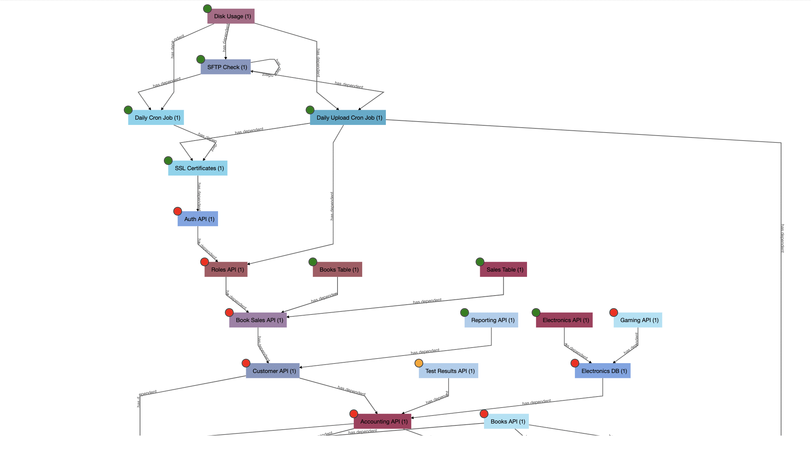
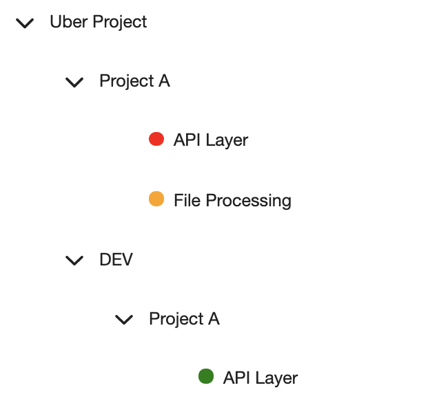
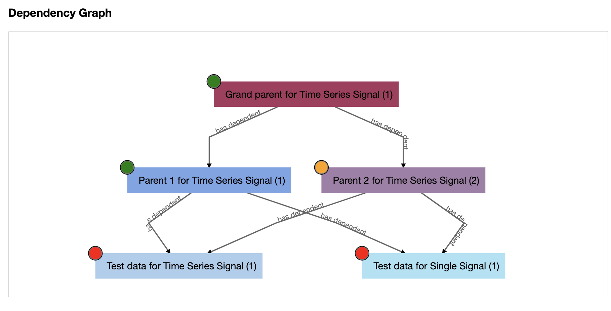
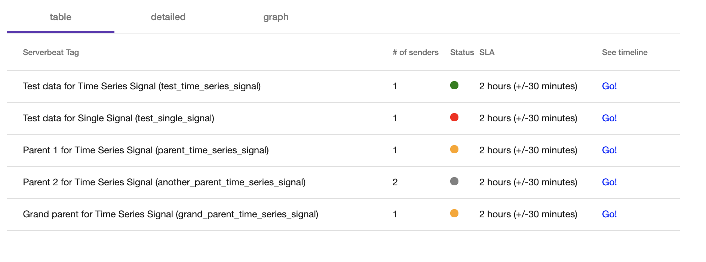
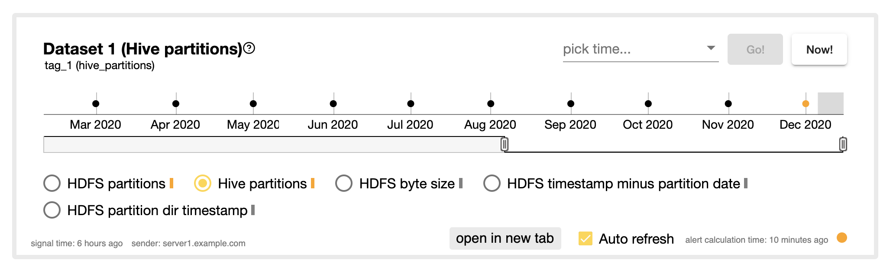
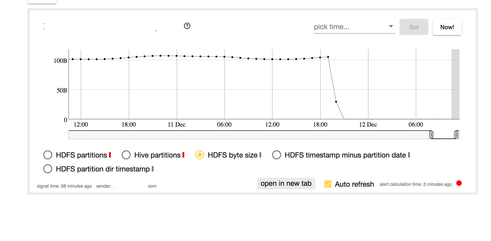

## About
 
ServerBeat is a experimental, minimalistic monitoring tool developed with NestJS, Angular, and SQLite.

The goal of the tool is to monitor events that are expected to happen on relatively fixed intervals and in minutes, hours, days, or higher granularities.

The tool supports features like dependency graphs, SLA, tolerance for late/early events, the ability to interpolate missing data points (for display purposes), recalculation of alerts every few minutes regardless of whether new signals or received or not, and more.





### Config Files and GUI End Points
Environment variable: SERVERBEAT_PROJECTS_DIR should be set to point to the location of the projects directory.

Each subdirectory inside the projects directory is considered to be an independent project and is accessible by going to http path: /project/\<project subdir\>.

Check apps/projects/test-project directory for sample configs.


### More Details

Each event type is specified by a "tag" which is a yaml file located under tags directory in the project subdirectory.
Each event type can have various "subtags" related to each of the properties of the event that should be monitored. For example, if a directory is monitored for existence of files, each file that is detected might have a size, creation time, last open time that must be monitored. Each of them corresponding to a subtag.

Each event type can be received from one or more senders and with one or more red/yellow/green status check known as alerts. the association between each tag, its possible senders, and the type of alert that is required for that particular combination is specified in the tree.yaml file.

tree.yaml file also includes the project tree structure. Check the example file and the screenshot below.



Each Leaf node in the project tree corresponds to a dependency graph of events.


There are two other modes for displaying the tags, one of them is the tabular form:


And the other is detailed mode where all the timeseries graphs are drawn in one page (not recommended for large graphs).


### Alerting Config
Sample alerts can be found in the projects directory. 

### Sample Tag/Subtag Configs

You can see different types of configs in the sample directory

```yaml
type: multi
display_name: Parent 2 for Time Series Signal
description: This is a test
frequency: 60 # expecting signals every 60 minutes
tolerance: 30 # each signal can come up to 30 minutes early/late
sla: 120 # the past 120 minutes from present time are part of the SLA, so not considered for alerting
critical_window: 1440 # display one full day of data in the timeseries graph
subtags:
    - type: time_series
      subtag: hdfs_partitions # the sender should send a signal for a tag (corresponding to the file name) + subtag 
      display_name: HDFS Partitions
      is_default: false
      draw_missing: true

    - type: time_series
      subtag: hive_partitions
      display_name: Hive Partitions
      is_default: true # only one subtag can be default, where the display defaults to
      draw_missing: true

    - type: time_series_with_size
      subtag: hdfs_size
      display_name: HDFS File Size
      is_default: false
      draw_missing: false

dependencies:
    - grand_parent_time_series_signal # parent tag; used to draw the dependency graph

```

A sample time series data corresponding to single tag looks like:



The gray area on the right side of the line chart is corresponding to SLA (not considered) and radio buttons are corresponding to the subtags.
There are two timestamps one on the left indicating when the sender last sent a signal. The one on the right indicates the last time the alert was calculated (note that with every minute passing the status of the alert might change even if no new signals are received).

### Sender End Points
Senders can send a single data point or a time series with each signal.

A single data point will overwrite the previous single data point if it has the exact same event timestamp. Otherwise it will be added to the existing timeseries stored in the DB. For example when a cron job is monitored, a single data point will be sent to the ServerBeat API every time the cronjob is ran.

A timeseries of data points will replace the whole previous timeseries stored for the given tag/sender combination. For example in case a HDFS directory is being monitored every time all timestamps under a directory should be sent.

Note that a dropdown is available for each timeseries report in the GUI to see not only the current timeseries report but also the historical timeseries graphs.


- single signal endpoint: http://\<api>/project/\<project subdir>/single-signal
- timeseries signal endpoint:  http://\<api>/project/\<project subdir>/time-series-signal

A sample JSON for timeseries data (see tag configs) with no numerical value.
```bash
{
    "serverbeatTag": "sample_tag",
    "serverbeatSubtag": "hdfs_partitions",
    "signalTimestamp": 1609465915,
    "sender": "server1.example.com",
    "dataPoints": [
    {
        "status": "OK",
        "timestamp": "1551132000",
        "message": "partition[201902252200] exists"
    },
    {
        "status": "OK",
        "timestamp": "1551135600",
        "message": "partition[201902252300] exists"
   }
}
```

Sample single data point signal with a numerical value:
```bash
{
    "serverbeatTag": "sample_tag",
    "serverbeatSubtag": "sample_subtag",
    "signalTimestamp": 1609466265,
    "sender": "server2.example.com",
    "dataPoints": [
        {
            "status": "NOT_OK",
            "timestamp": 1609466265,
            "message": "OK",
            "numericValue": 41
        }
    ]
}

```

More sample calls can be found in serverbeat.postman_collection file in test-project directory.

### Auth
The sampel in NoAuthModule can be followed to create new forms of authorization for the GUI.
For sender APIs the end points are open access in the first version.


### Run
```bash
npm install
```


Start GUI:
```bash
export NODE_OPTIONS=--max_old_space_size=4096
export SERVERBEAT_PROJECTS_DIR=<location of serverbeat projects directory>
npm run-script start_prod_gui
```

Start API:
```bash
export NODE_OPTIONS=--max_old_space_size=4096
export SERVERBEAT_PROJECTS_DIR=<location of serverbeat projects directory>
npm run-script start_prod_api
```


